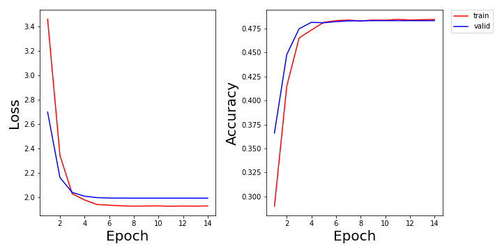

# basic_vqa
Pytorch implementation of the paper - VQA: Visual Question Answering (https://arxiv.org/pdf/1505.00468.pdf).

## Usage 

#### 1. Clone the repositories
```bash
$ git clone https://github.com/tbmoon/basic_vqa.git
```

#### 2. Download and unzip the dataset from official url of VQA: https://visualqa.org/download.html

```bash
$ cd basic_vqa/utils
$ chmod +x download_and_unzip_datasets.csh
$ ./download_and_unzip_datasets.csh
```

#### 3. Preproccess input data for (images, questions and answers)

```bash
$ python resize_images.py --input_dir='../datasets/Images' --output_dir='../datasets/Resized_Images'  
$ python make_vacabs_for_questions_answers.py --input_dir='../datasets'
$ python build_vqa_inputs.py
```

#### 4. Train model for VQA task

```bash
$ python train.py
```

## Results

- Loss and Accuracy on VQA datasets
  + Experiment 1: Prediction of '\<UNK\>' is not accepted as Answer.




## References
* Paper implementation
  + Paper: VQA: Visual Question Answering
  + URL: https://arxiv.org/pdf/1505.00468.pdf
    
* Pytorch tutorial
  + URL: https://pytorch.org/tutorials/
  + Github: https://github.com/yunjey/pytorch-tutorial
  + Github: https://github.com/GunhoChoi/PyTorch-FastCampus

* Preprocessing:
  + Tensorflow implementation of N2NNM
  + Github: https://github.com/ronghanghu/n2nmn
